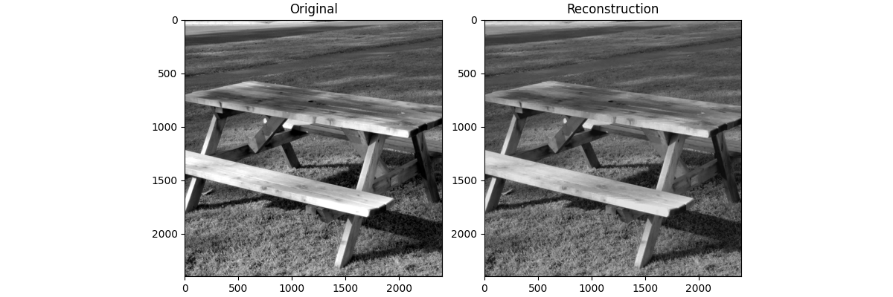

[Next ->](1_image_psnr.md)

We chose to start with the garden table image (`img_2400X2400_3X16bit_C00C00_RGB_garden_table.png`) from the [TESTIMAGES](https://testimages.org/) dataset, but in principle any uncompressed image should work.  To convert to gray scale, please see the [TESTIMAGES](https://testimages.org/) website. 

```python
import sys
import os

# Add project root to path
sys.path.append(os.path.abspath(".."))
```
```python
import numpy as np
import imageio.v3 as iio
import matplotlib.pyplot as plt

from core.data import CompressionMetrics
from core.utils import convert_to_gray_scale, round_sig
from core.image import compress_image, reconstruct_image
```
```python
# import the image, and convert to gray scale
img_rgb = iio.imread("sources/garden_table.png").astype(np.float32)
img_gray = convert_to_gray_scale(img_rgb)
plt.imshow(img_gray, cmap="gray")
plt.show()
```
```python
# Hyperparameters
block_size = 20
poly_degree = 15
lp_degree = 2.0
cutoff = None
```
```python
# Obtain coefficients, design matrix, and rescale function (callable)
c, X_design, rescale = compress_image(
    img_gray,
    poly_degree=poly_degree,
    block_size=block_size,
    lp_degree=lp_degree,
    p_inv=True
)
```
The image is broken up into 2D blocks.  A Larger block size allows for a higher polynomial
degree.  **Note:** It is possible to use Lasso regression, but we've primarily used the
Moore-Penrose inverse (`p_inv`) instead.  One advantage of doing this, is to avoid
finding/computing $\alpha$.

If using Lasso is preferred, you can either use LassoCV, or `compute_alpha` defined in
`utils.py`.  **Note:** This is a work in progress.  You may need to compute alpha, if using
Lasso is necessary.

We've observed a significant reduction in runtime since using the Moore-Penrose inverse,
however, and would recommend it over Lasso.

```python
# round_sig forces np.float16 — achieve smaller file size
c = round_sig(c)
img_gray_rec = reconstruct_image(c, X_design, rescale)
```
```python
# Saving coefficients
np.save("../results/image/garden_table/coefficients/coefficients__bs=%s__cutoff=%s__lp=%s__poly_deg=%s__dtype=%s.npy" %
(block_size, cutoff, lp_degree, poly_degree, c.dtype), c, allow_pickle=False)
```
Let's compare our compressed result to the original
```python
fig, ax = plt.subplots(1, 2, figsize=(12, 4), layout="compressed")
ax[0].imshow(img_gray, cmap="gray")
ax[0].set_title("Original")

ax[1].imshow(img_gray_rec, cmap="gray")
ax[1].set_title("Reconstruction")

fig.savefig("../results/image/garden_table_rec.png")

plt.show()
```
Now we acquire the metrics, and display them in a table
```python
metrics = CompressionMetrics(img_gray, img_gray_rec, c)
```
```python
import pandas as pd
metrics_dict = {
    "Metric": ["Nonzero Coefficients (%)", "MSE", "PSNR (dB)", "Compression Ratio (%)",
               "Space Saved (%)"],
    "Value": [metrics.nz_percent, metrics.mse, metrics.psnr, metrics.compression_ratio,
              metrics.space_saved]
}
df = pd.DataFrame(metrics_dict)
print(df)
```



---

[Next ->](1_image_psnr.md)
