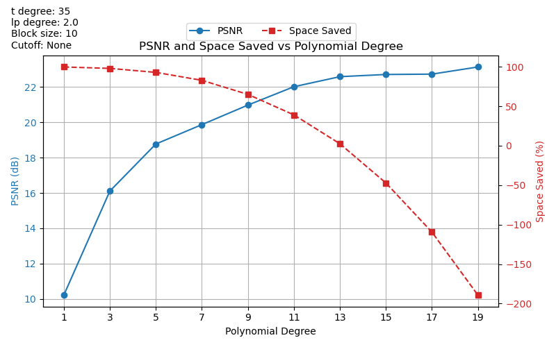
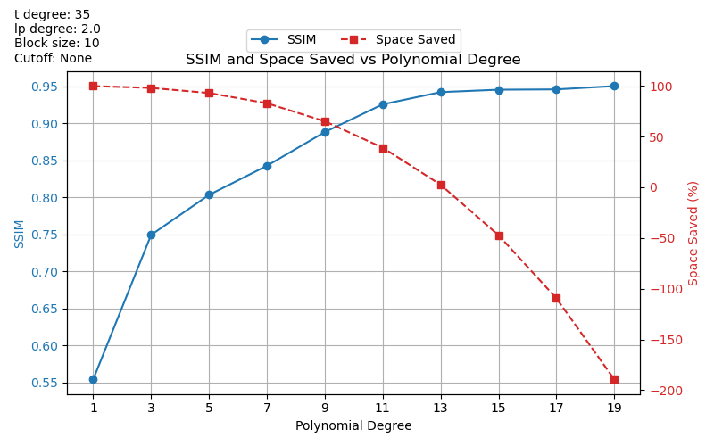

[Back to Home](../../README.md)

[<- Previous](6_video3d_example.md) | [Next ->](8_optimize_parameters.md)

As we've already seen, this notebook is very similar to the other `*_psnr.ipynb` notebooks,
and computing the metrics for 3D videos can be challenging.  However, for completeness, let's
go over it.

```python
import sys
import os

# Add project root to path
sys.path.append(os.path.abspath(".."))
```
```python
import numpy as np
import tifffile as tiff
import imageio.v3 as iio
import matplotlib.pyplot as plt
import matplotlib.animation as animation

from core.data import CompressionMetrics
from core.utils import make_dual_update, round_sig
from core.video3d import reconstruct_video3d, compress_video3d
```
```python
# Importing the video takes a while, so I put the import statement in its own cell.
# This way, we can make changes in the notebook without needing to import the video again.
video3d_raw = tiff.imread("../sources/Fluo-N3DL-DRO/01/*.tif")
```
```python
# True dimensions are (125, 603, 1272) - should crop to (120, 600, 1200)
nz, ny, nx = 100, 100, 100

# video3d_raw[:, :100, :100, :100] was all black; video3d_raw.min() == video3d_raw.max() == 0
# Below volume has actual data
video3d = video3d_raw[:, :nz, 200:300, 400:500]
```
```python
# Hyperparameters
poly_degrees = np.arange(2, 20, 1)
t_degree = 45
lp_degree = 2.0
block_size = 10
cutoff = None

# We'll use this to display the static parameters on the graphs
params = {
        "t degree": t_degree,
        "lp degree": lp_degree,
        "Block size": block_size,
        "Cutoff": cutoff
    }
```
```python
# Loop
metrics_list = []
video3d_rec_list = []
c_t_list = []
for poly_degree in poly_degrees:
    c_t, X_design, t_design_matrix, rescale = compress_video3d(
    video3d,
    poly_degree=poly_degree,
    t_degree=t_degree,
    block_size=block_size,
    lp_degree=lp_degree,
    cutoff=cutoff
    )
    c_t = round_sig(c_t)

    # Saving coefficients
    np.save("../results/video3d/drosophila_video_full_01/coefficients/coefficients__bs=%s__cutoff=%s__lp=%s__poly_deg=%s__t_degree=%s__dtype=%s.npy" %
            (block_size, cutoff, lp_degree, poly_degree, t_degree, c_t.dtype), c_t, allow_pickle=False)
    c_t_list.append(c_t)
    video3d_rec = reconstruct_video3d(
        video3d,
        block_size,
        c_t,
        X_design,
        t_design_matrix,
        rescale
    )
    metrics_list.append(CompressionMetrics(video3d, video3d_rec, c_t))
    video3d_rec_list.append(video3d_rec)
```
Notice in the cell above, the naming convention for saving the coefficients doesn't include the
shape of the video used.  If you'd like to experiment with different sizes of the video,
including the shape when naming the file would be recommended.

Since we experienced difficulties when computing the metrics for larger video sizes, and this
notebook is intended to compute metrics, we decided to omit `video.shape` from this notebook.

If experimenting in depth is what you desire, perhaps more than simply including the shape in
the name may be required.  
```python
# Extract values
psnr_values = [m.psnr for m in metrics_list]
ssim_values = [m.ssim for m in metrics_list]
compression_ratios = [m.compression_ratio for m in metrics_list]
space_saved_values = [m.space_saved for m in metrics_list]
```
Plotting PSNR and Space Saved vs Polynomial Degree
```python
# Create figure and primary axis
fig, ax1 = plt.subplots(figsize=(8, 5))

# Plot PSNR on primary y-axis
ln1 = ax1.plot(poly_degrees, psnr_values, marker="o", linestyle="-", color="tab:blue", label="PSNR")
ax1.set_xlabel("Polynomial Degree")
ax1.set_ylabel("PSNR (dB)", color="tab:blue")
ax1.tick_params(axis="y", labelcolor="tab:blue")
ax1.grid(True)
ax1.set_xticks(poly_degrees)

# Plot space saved on secondary y-axis
ax2 = ax1.twinx()
ln2 = ax2.plot(poly_degrees, space_saved_values, marker="s", linestyle="--", color="tab:red", label="Space Saved")
ax2.set_ylabel("Space Saved (%)", color="tab:red")
ax2.tick_params(axis="y", labelcolor="tab:red")

# Combine legends and place outside top-left
lines = ln1 + ln2
labels = [l.get_label() for l in lines]
ax1.legend(lines, labels, loc="upper center", bbox_to_anchor=(0.5, 1.15), ncol=2)

plt.title("PSNR and Space Saved vs Polynomial Degree")

# To display other (fixed) params
param_text = "\n".join([f"{k}: {v}" for k, v in params.items()])

# Add text in figure coordinates (top-left)
fig.text(
    0.02, 0.98, # x, y in figure coords
    param_text,
    ha='left', va='top',
    fontsize=10,
     bbox=dict(facecolor="white", alpha=0.8, edgecolor="none")
)

fig.subplots_adjust(top=1.07)

plt.tight_layout()
plt.savefig("../results/video3d/drosophila_video_full_01/plots/psnr__pinv__bs=%s__cutoff=%s__lp=%s__poly_degree=%s-%s__t_degree=%s__dtype=%s.png" % 
            (block_size, cutoff, lp_degree, poly_degrees[0], poly_degrees[-1], t_degree, c_t_list[0].dtype))
plt.show()
```


Plotting SSIM and Space Saved vs Polynomial Degree
```python
# Create figure and primary axis
fig, ax1 = plt.subplots(figsize=(8, 5))

# Plot SSIM on primary y-axis
ln1 = ax1.plot(poly_degrees, ssim_values, marker="o", linestyle="-", color="tab:blue", label="SSIM")
ax1.set_xlabel("Polynomial Degree")
ax1.set_ylabel("SSIM", color="tab:blue")
ax1.tick_params(axis="y", labelcolor="tab:blue")
ax1.grid(True)
ax1.set_xticks(poly_degrees)

# Plot space saved on secondary y-axis
ax2 = ax1.twinx()
ln2 = ax2.plot(poly_degrees, space_saved_values, marker="s", linestyle="--", color="tab:red", label="Space Saved")
ax2.set_ylabel("Space Saved (%)", color="tab:red")
ax2.tick_params(axis="y", labelcolor="tab:red")

# Combine legends and place outside top-left
lines = ln1 + ln2
labels = [l.get_label() for l in lines]
ax1.legend(lines, labels, loc="upper center", bbox_to_anchor=(0.5, 1.15), ncol=2)

plt.title("SSIM and Space Saved vs Polynomial Degree")

# To display other (fixed) params
param_text = "\n".join([f"{k}: {v}" for k, v in params.items()])

# Add text in figure coordinates (top-left)
fig.text(
    0.02, 0.98, # x, y in figure coords
    param_text,
    ha='left', va='top',
    fontsize=10,
     bbox=dict(facecolor="white", alpha=0.8, edgecolor="none")
)

fig.subplots_adjust(top=1.07)

plt.tight_layout()
plt.savefig("../results/video3d/drosophila_video_full_01/plots/psnr_plots/ssim__bs=%s__cutoff=%s__lp=%s__poly_degree=%s-%s__t_degree=%s__dtype=%s.png" % 
            (block_size, cutoff, lp_degree, poly_degrees[0], poly_degrees[-1], t_degree, c_t_list[0].dtype))
plt.show()
```


We've observed some strange results with these graphs.  For example, largely negative
`space_saved` values.  We plan to look into this more in the future.

SSIM metric has been implemented, but not included in every `*.ipynb` notebook.  See
`core/data.py` for implementation.  

**Note:** Other metrics from `skimage.metrics` can also be easily implemented.  For guidance,
 please see the [documentation](https://scikit-image.org/docs/stable/api/skimage.metrics.html).


This covers the basis of the project, and should hopefully give some insight into the project's
development.

---
[Back to Home](../../README.md)

[<- Previous](6_video3d_example.md) | [Next ->](8_optimize_parameters.md)
